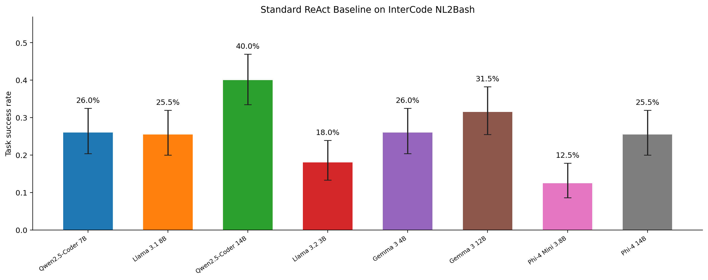

# ARFA

**Residual-Guided Reasoning Control for Terminal-Based Coding Agents**

An agent runs a command, observes the result, and decides what to do next. ARFA
compares that result with what the agent expected. We call the difference an
execution residual and use it as a reference for deciding when to reason again.

## Progress

- **Phase 1/1.5:** collected 300 shadow runs from three models on 100 shared tasks.
  The 790 executed steps have recorded expectations, outputs, and residual values.
  The agent still reasoned after every observation during collection.
- **Phase 2:** completed 1,600 always-reason baseline runs: eight models on the
  same 200 InterCode tasks. All eight task-ID and recorded-protocol audits pass.
  Four fast/slow model pairs now have individual baselines.
- **Phase 3:** next is to implement and test fast/slow execution. The current code
  is a scaffold, not a running controller.

## Results

In the shadow study, mean structured residual was 0.088 for Qwen 14B, 0.123 for
Qwen 7B, and 0.211 for Llama 8B. Task success was 42%, 22%, and 21%, respectively.
These patterns support studying residual as a decision signal; they do not yet
show which model to call for an individual task.

Against the existing human-reviewed, AI-assisted labels, the full residual score
had test AUC 0.743 (95% CI 0.681-0.811). Learned observation-only scoring reached
0.749. Label-based results remain provisional because of an earlier judge-prompt
issue; [study notes](docs/residual_constraints.md) explain the source and scope.

### Phase 2 Baselines

All models completed 200 attempts. Task success means evaluator reward >= 0.99;
failed attempts remain in the denominator. Times include the task execution.

| Model | Successful tasks | Success rate | Seconds/task | Calls/task |
| --- | ---: | ---: | ---: | ---: |
| Qwen2.5-Coder 7B | 52/200 | 26.0% | 47.29 | 5.28 |
| Qwen2.5-Coder 14B | 80/200 | 40.0% | 85.70 | 3.29 |
| Llama 3.2 3B | 36/200 | 18.0% | 24.37 | 6.12 |
| Llama 3.1 8B | 51/200 | 25.5% | 58.69 | 3.98 |
| Gemma 3 4B | 52/200 | 26.0% | 22.98 | 3.02 |
| Gemma 3 12B | 63/200 | 31.5% | 86.61 | 4.11 |
| Phi-4 Mini 3.8B | 25/200 | 12.5% | 26.46 | 3.72 |
| Phi-4 14B | 51/200 | 25.5% | 94.80 | 3.14 |



The [writing bundle](docs/phase2_writing_bundle/README_FOR_WRITING.md) includes
paired comparisons, uncertainty intervals, a 195-task gold-healthy analysis,
failure diagnostics, and downloadable PNG/PDF figures and Markdown/LaTeX tables.
Latency and token usage are measured; energy consumption has not been measured.
Phase 3 will measure whether consulting residual reduces reasoning cost while
preserving task success.

## Read And Reproduce

- [Writing guide](docs/README_FOR_WRITING.md)
- [Residual formulas and results](docs/residual_diagnostics.md)
- [Per-step scores](evidence/residual_diagnostics/step_scores.csv) and
  [task scores](evidence/residual_diagnostics/task_scores.csv)
- [Model summaries](evidence/residual_diagnostics/summary.json) and
  [label comparisons](evidence/residual_diagnostics/annotation_association.json)
- [Phase 2 results](docs/phase2_writing_bundle/README_FOR_WRITING.md)
- [Phase 2 expansion protocol and status](docs/03_phase2_baseline_agent.md)
- [Phase 3 plan](docs/04_phase3_arfa_dual_track.md)
- [Phase 3 pre-run study protocol](docs/phase3_study_protocol.md)

With the existing Python environment and cached MiniLM model:

```bash
bash scripts/phase1_export_diagnostics.sh
.venv/bin/python -m pytest -q
bash scripts/phase3_run_arfa.sh
```

The first command exports scores from saved traces. The last reports development
readiness; it does not launch an agent.

## Repository

Code is in `src/`, settings in `config/`, and command entry points in `scripts/`.
Current numeric evidence is in `evidence/residual_diagnostics/`; older reports are
in `docs/archive/`. The tracked Phase 2 writing package covers the complete
eight-model matrix. Model-selection history is documented in the
[Phase 2 protocol](docs/03_phase2_baseline_agent.md).

Tasks come from [InterCode](https://github.com/princeton-nlp/intercode). Downloaded
external data stays in `data/phase1/external_intercode/`; our local shadow runs stay
in `results/phase1_5_shadow/full/`. Full traces, raw labels, and model caches are
not uploaded. Existing source paths and frozen files are kept for reproduction.

`main` holds code and results; `paper` is intended for manuscript drafts. Use a
code commit and the artifact manifests to identify the results behind each draft.
